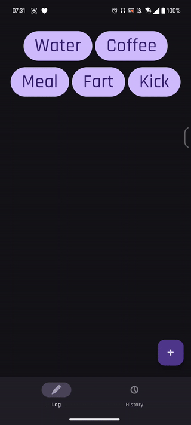

# `ButtonBoy`: a local event logger for android

Source code for an event logger in android. Writes to a local database, can be exported to csv. 

Installer is in `app/release/app-release.apk`. You might have to enable third party installations.
